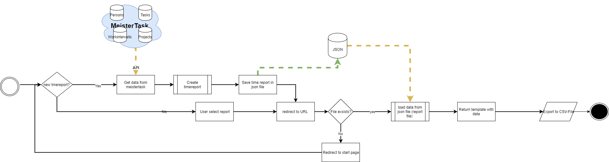

# staysmart timereporter
  

## Ausgangslage

### Abstract
Im Verein stay smart arbeiten wir mit MeisterTask. Dort verteilen wir die Aufgaben und erfassen die Zeit. Leider ist der Export der Zeiterfassung mühsam. Da das CSV-Format nicht eine einfache Umwandlung im Excel ermöglicht. Zudem gibt es keine Möglichkeit pro Projekt eine Auswertung zu machen (ohne die Pro Version zu kaufen), ebenfalls ist das auch nicht über mehrere Projekte möglich. Daher ergibt sich für den Verein einen unnötigen Aufwand, den man mit einer Software umgehen könnte. 

### Projekt- Idee
Meine Idee ist es eine Webapplikation zu entwickeln, die es mir und dem Verein ermöglicht eine Auswertung über mehrere Projekte in MeisterTask zu erstellen und somit viel Aufwand zu ersparen. Dazu möchte ich die API Schnittstelle von Meistertask als Datenquelle benützen. Zuerst muss man sich mit seinem persönlichen Token authenzieren. Folglich soll man in meiner Webapp per Forumlar auswählen welche Projekte man in der Auswertung beachten möchte, es könnte sein, dass man nicht alle Projekte vom Verein sind. Als nächstes  gibt man in das Forumlar, was für eine Stundenlohn angewendet werden soll. Dann kann man die Auswertung starten und man gelangt auf eine Übersicht Seite mit allen Personen aus den Projekten. Dort sieht man pro Person das Total an Arbeitstunden und die zu bezahlende Entschädigung. Ebenfalls ist ersichtlich was der Verein gesamthaft bezahlen muss und wie viele Stunden gearbeitet wurde. Wenn man drauf klickt sieht man die Auswertung pro Person (Stunden und Entschädigung). 

### Anforderung an das Projekt
- Eingabe von Stundenlohn und Auswahl von Projekten die ausgewertet werden sollen. 
- Einlesen und speichern von Projekten, Tasks, Projektmitgliedern und Arbeitsintervallen durch die API von Meistertaks
- Auswerten der Arbeitszeit. (pro Person, pro Projekt und pro Task)
- Ausgabe der Zeit pro Projekt als CSV für die Buchhaltung (Summe pro Projekt und Gesamt)

## Workflow

### Dateneingabe und Datenquelle
Die Daten für die Zeiterfassung stammen direkt aus der Projektmanagment Software MeisterTask. Dazu wurde die API von Meistertask verwendet. Die Applikation greift direkt mittels OAuth2-Authentifizierung auf die Daten zu. Im Benutzermenü von staysmart timereporter kann der Benutzer dann auswählen, welche Projekte ausgewertet werden sollen.

### Datenverarbeitung
MeisterTask liefert nur Rohdaten. Daher muss die Applikation die Daten verarbeiten. Das geschieht mit den Funktionen in der Libary report.py. Dort werden 

### Datenausgabe 

### Ablauf

## Benutzeranleitung

### Requirements

### Installation der Applikation

Anwendung der Applikation
====
**Erstellen eines neuen Reports**

1. Rufen Sie in Ihrem Browser **https://127.0.0.1:5000**

2. Vertrauen Sie der Webseite, diese Meldung können Sie ignoriern. 

3. Klicken Sie auf **Login**.
4. Nun werden Sie auf eine Loginseite von Meistertask weitergeleitet. Geben Sie dort ihre Zugriffdaten ein. (@fabod diese haben Sie in einem separaten Mail erhalten.)

5. Erlauben Sie der Applikation den Zugriff.

6. Folglich sehen Sie eine Auswahl von Projekten, die Projekt die Sie selektieren werden ausgewertet.Danach können sie unterhalb noch den Studenlohn definiern und den Mitgliederbeitrag das jedes Mitglied bezahlen soll. 

7. Alles eingegeben? Dann klicken Sie auf **Projekte auswerten**

8. Dann werden Sie auf die erste Auswertung weitergeleitet. Sie sehen nun die Auswertung pro Projekt. 

**Ansehen eines bereits erstellten Reports**

1. Wählen Sie aus dem Dropdown Menü, unter dem Titel Bestehende Auswertung, einen voherigen Report aus. 

2. Folglich klicken Sie auf **Auswertung ansehen**

3. Dann werden Sie auf die erste Auswertung weitergeleitet. Sie sehen nun die Auswertung pro Projekt. 

**Auswertung pro Projekt**

In der Auswertung pro Projekt sehen sie die Projekte, die Sie für die Auswertung selektiert haben. Sie gelangen über den Menüpunkt **Projekte** zu dieser Ansicht. In der Tabelle können Sie drei Informationen pro Projekt entnehmen. In der ersten Spalte sehen sie den Projektnamen, in der zweiten Spalte sehen sie die Zeit die für dieses Projekt aufgezeichnet wurde und in der letzten Spalte können Sie die Kosten sehen die das Projekt verursacht. Der Mitgliederbeitrag wurde hier nicht abgezogen, da Mitglieder an meherern Projekten arbeiten können. 

**Auswertung pro Person**

In der Auswertung pro Person sehen sie die Personen, die Sie für die Projekte gearbeitet haben. Sie gelangen über den Menüpunkt **Personen** zu dieser Ansicht. In der Tabelle können Sie vier Informationen direkt pro Projekt entnehmen. Zudem haben Sie die Option eine detailierte Ansicht einzusehen. In der ersten und zweiten Spalte sehen sie den Vornamen und Nachnamen der Person. In der nächsten Spalte sehen Sie die Zeit, die die Person inverstierte.In der vierten Spalte können Sie den Lohn sehen die diese Person erhalten sollte. Der Mitgliederbeitrag wurde hier abgezogen. In der letzten Spalte finden Sie den **Detail** Button durch diesen gelangen sie in die Detail ansicht des Mitgliedes

In der Detailansicht sehen eine detailierte Abrechnung. Zu einem kann man sehen wie viel Stunden die Person in dem jeweiligen Projekt gearbeitet hat und wie viel Kosten die Person pro Projekt generiert hat. Zudem sehen Sie den Mitgliederbeitrag-Abzug, wie auch die Summe. Falls diese unter 0 CHF ist wird es einfach als 0 CHF angezeigt. Einen Minusbetrag ist nicht möglich. 

**Auswertung pro Task**

**Export der Auswertung im CSV-Format**

