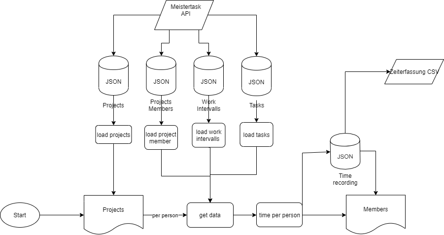

## Abstract
In meinem Verein arbeiten wir mit MeisterTask. Dort verteilen wir die Aufgaben und erfassen die Zeit. Leider ist der Export der Zeiterfassung mühsam. Da das CSV-Format nicht eine einfache Umwandlung im Excel ermöglicht. Zudem gibt es keine Möglichkeit pro Projekt eine Auswertung zu machen (ohne die Pro Version zu kaufen), ebenfalls ist das auch nicht über mehrere Projekte möglich. Daher ergibt sich für den Verein einen unnötigen Aufwand, den man mit einer Software umgehen könnte. 
## Projekt- Idee
Meine Idee ist es eine Webapplikation zu entwickeln, die es mir und dem Verein ermöglicht eine Auswertung über mehrere Projekte in MeisterTask zu erstellen und somit viel Aufwand zu ersparen. Dazu möchte ich die API Schnittstelle von Meistertask als Datenquelle benützen. Zuerst muss man sich mit seinem persönlichen Token authenzieren. Folglich soll man in meiner Webapp per Forumlar auswählen welche Projekte man in der Auswertung beachten möchte, es könnte sein, dass man nicht alle Projekte vom Verein sind. Als nächstes  gibt man in das Forumlar, was für eine Stundenlohn angewendet werden soll. Dann kann man die Auswertung starten und man gelangt auf eine Übersicht Seite mit allen Personen aus den Projekten. Dort sieht man pro Person das Total an Arbeitstunden und die zu bezahlende Entschädigung. Ebenfalls ist ersichtlich was der Verein gesamthaft bezahlen muss und wie viele Stunden gearbeitet wurde. Wenn man drauf klickt sieht man die Auswertung pro Person (Stunden und Entschädigung). 
## Anforderung
- Eingabe von Token (für Zugriff),Stundenlohn und Auswahl von Projekten die ausgewertet werden sollen. 
- Einlesen und speichern von Projekten, Tasks, Projektmitgliedern und Arbeitsintervallen durch die API von Meistertaks
- Auswerten der Arbeitszeit. (pro Person, pro Projekt und pro Task)
- Ausgabe der Zeit pro Projekt als CSV für die Buchhaltung (Summe pro Projekt und Gesamt)
 

## Ablauf

